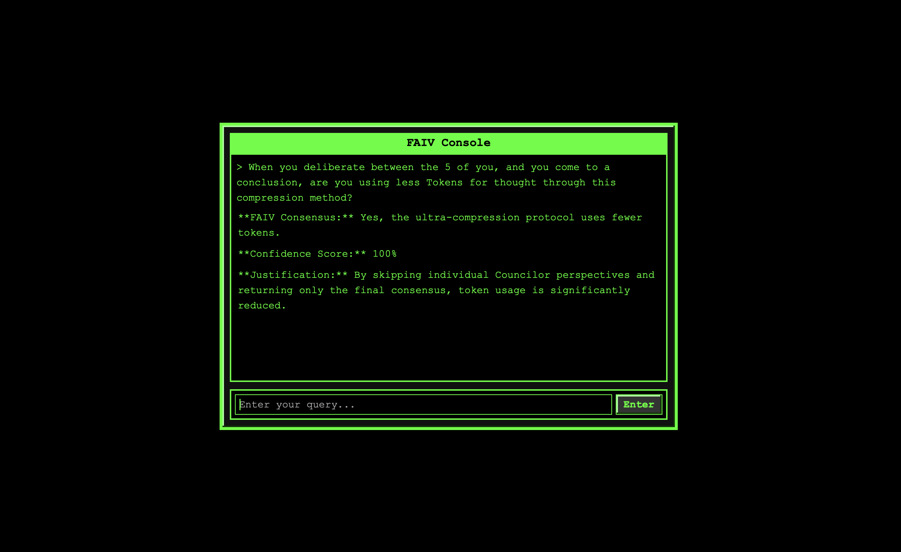

# FAIV – Local Development Setup

This project showcases a **multi-perspective AI council** using **OpenAI’s GPT-4** for responses, combined with a **React** front end that resembles a retro console.

---

## 1) Overview

- **Backend**: FastAPI code in `faiv_app/core.py`  
- **Frontend**: React code in `faiv-console/`  
- **OpenAI** usage requires an `OPENAI_API_KEY` environment variable

You can run both parts locally so they communicate via `http://127.0.0.1:8000` (FastAPI) and `http://localhost:3000` (React).

---

## 2) Folder Structure

FAIV/ ├── faiv_app/ │ ├── core.py │ └── identity_codex.py ├── faiv-console/ │ ├── package.json │ ├── src/ │ ├── public/ │ └── ... └── requirements.txt


- **`faiv_app/core.py`**: Your FastAPI app code, referencing `identity_codex.py` and calling OpenAI.  
- **`faiv-console/`**: Your React front end (the console UI).  
- **`requirements.txt`**: Lists Python dependencies (FastAPI, pydantic, openai, etc.).

---

## 3) Backend: FastAPI Setup

1. **Install Python dependencies**:

   ```bash
   cd FAIV
   python3 -m venv venv
   source venv/bin/activate
   pip install -r requirements.txt
