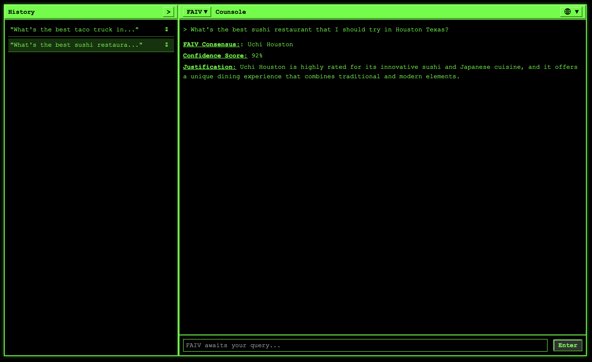

# FAIV – Multi-Pillar Council Setup

This project demonstrates a multi-perspective AI “council” using OpenAI’s GPT-4 for responses. It combines a React retro-styled console front end with a FastAPI backend, wrapped in a Flask WSGI container for hosting flexibility when deployed in production.

---

## 1. Overview

### Backend
- Located in `faiv_app/core.py`, featuring a FastAPI application.
- In production (e.g., with Passenger), we expose a Flask wrapper (WSGIMiddleware) as "application".
- Uses Redis for session-based memory and GPT-4 for AI responses.

### Frontend
- A React application in `faiv-console/`, styled as a classic console interface.
- Dynamically queries the backend at `http://127.0.0.1:8000/query/`.

### Environment
- Requires `OPENAI_API_KEY` in the environment.
- Optionally configure Redis host/port in `core.py` if needed.

---

## 2. Folder Structure

```
FAIV/
├── README.md                  (This file)
├── requirements.txt           (Python dependencies)
├── faiv_app/                  (Backend code)
│   ├── core.py                (FastAPI + Flask wrapper)
│   ├── identity_codex.py      (Identity Codex data)
│   └── ...
└── faiv-console/              (Frontend React code)
    ├── package.json
    ├── src/
    ├── public/
    └── build/                 (Generated by "npm run build")
```

---

## 3. Backend Setup

### Local Development

1. **Create & Activate Virtual Env**
   ```sh
   cd FAIV
   python3 -m venv venv
   source venv/bin/activate
   ```

2. **Install Dependencies**
   ```sh
   pip install -r requirements.txt
   ```

3. **Set Your API Key**
   ```sh
   export OPENAI_API_KEY="sk-YourOpenAIKey"
   ```

4. **Launch the FastAPI Server**
   ```sh
   uvicorn faiv_app.core:fastapi_app --host 127.0.0.1 --port 8000 --reload
   ```
   (Runs at `http://127.0.0.1:8000`)

### Production Deployment with Passenger

- Passenger can load the WSGI app from `faiv_app/core.py`:
  ```python
  from faiv_app.core import application
  ```
- Ensure `OPENAI_API_KEY` is set in the production environment.
- The Flask wrapper is already configured in `core.py`, no extra config needed.

---

## 4. Frontend Setup

### Development Mode

1. **Install Node Dependencies**
   ```sh
   cd faiv-console
   npm install
   ```

2. **Run the React Dev Server**
   ```sh
   npm start
   ```
   (Runs at `http://localhost:3000`, calls backend at `http://127.0.0.1:8000/query/`)

### Production Build

1. **Build the React App**
   ```sh
   cd faiv-console
   npm run build
   ```

2. **Deploy the `build/` Folder**
   These are your static files for production hosting.

---

## 5. Identity Codex & Dynamic Pillars

- `identity_codex.py` defines multiple “council members” grouped by pillars (Wisdom, Strategy, Expansion, Future, Integrity, plus default FAIV).
- The user can select which pillar to query from the React front end.
- `core.py` automatically includes only the relevant codex members in the AI’s prompt.

---

## 6. Example Screenshots

(Reference: place `faiv-ss.png` and `faiv-ss2.png` in the same directory for these examples.)

- Original Screenshot (`faiv-ss.png`)
- Updated Multi-Pillar Screenshot (`faiv-ss2.png`)

With multi-pillar, you’ll see lines like:
“Wisdom Council’s Consensus:” or “Future Council’s Consensus:” etc.

---

## 7. Troubleshooting

- **Missing `OPENAI_API_KEY`:**
  Make sure to set `export OPENAI_API_KEY="sk-YourKey"`

- **Redis Connection Issues:**
  Adjust host/port in `redis_client = redis.Redis(...)` in `core.py` if needed.

- **React Dev Server Not Finding API:**
  Confirm `uvicorn` is running on 8000. If needed, modify fetch calls in your React code.

- **Passenger Doesn’t Recognize WSGI:**
  Check `passenger_wsgi.py` contains:
  ```python
  from faiv_app.core import application
  ```
  Then restart Passenger.

---

## 8. Additional Notes

### Local Testing

### Production
Deploy via Passenger or any WSGI-compatible server. The “application” is the Flask-wrapped app in `core.py`.

### Frontend Updates
If you change the React code, run `npm run build` again to regenerate `build/`.

---

## 9. Git Workflow

If you want to push a new branch with your updated React build:

1. **Build Updated React**
   ```sh
   cd faiv-console
   npm run build
   ```

2. **Commit & Push**
   ```sh
   git checkout -b feature/pillar-dynamic
   git add .
   git commit -m "Add multi-pillar logic & updated console UI"
   git push -u origin feature/pillar-dynamic
   ```

---

**Enjoy the new multi-pillar FAIV council!**

---

